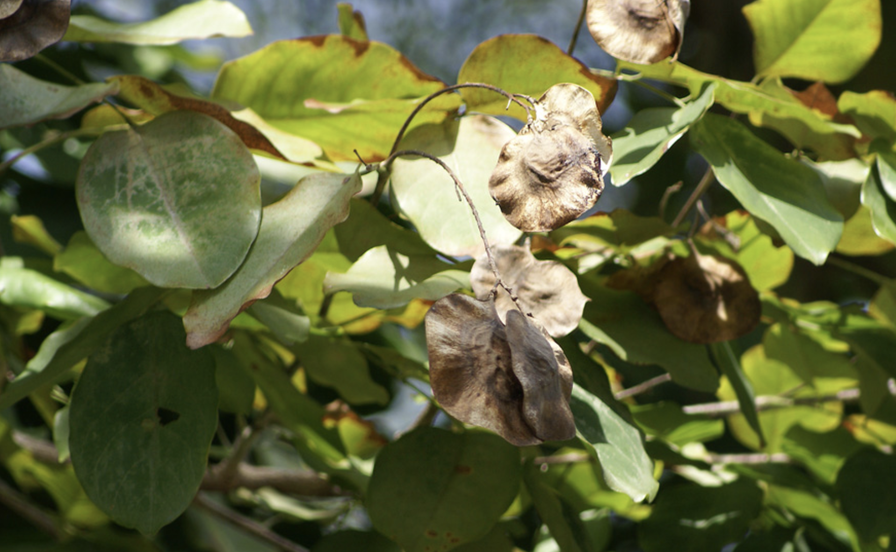

tags:: species
alias:: angsana, philippines mahogany, sana kembang

- 
- height: 30-40m
- http://www.plantsofasia.com/index/pterocarpus/0-151
- https://en.wikipedia.org/wiki/Pterocarpus_indicus
- https://www.tokopedia.com/tokomur4-1/bibit-angsana-bibit-stek-tanaman-angsana-pterocarpus-indicus?extParam=ivf%3Dfalse%26src%3Dsearch
- not a [[rosewood]]