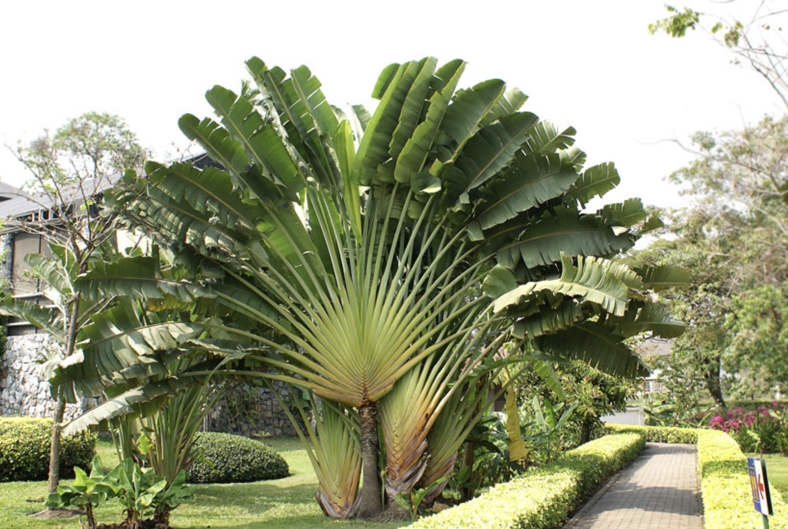

tags:: species
alias:: travellers palm, travellers tree

- 
- height: 30 m
- http://www.plantsofasia.com/index/ravenala/0-118
- https://en.wikipedia.org/wiki/Ravenala_madagascariensis
- https://www.tokopedia.com/plantismeid/tanaman-hias-ravenala-madagascariensis-travelers-palm-tree?extParam=ivf%3Dfalse
-