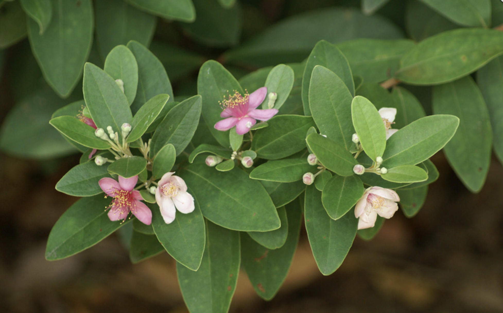

tags:: species
alias:: downy myrtle, hill guava, rose myrtle, kemunting

- 
- height: up to 4m
- https://en.wikipedia.org/wiki/Rhodomyrtus_tomentosa
- http://www.plantsofasia.com/index/rhodomyrtus/0-631
- https://www.tokopedia.com/veronicashopp/ad-egrow-50-pcs-pack-kemunting-bibit-kemunting-pohon-semente?extParam=ivf%3Dfalse%26src%3Dsearch&refined=true
-