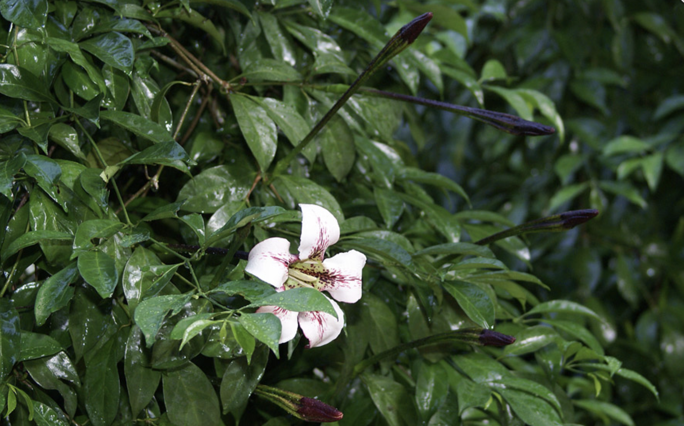

tags:: species
alias::terompet gading

- 
- height: up to 9 m
- http://www.plantsofasia.com/index/rothmannia_longiflora/0-289
- https://www.tokopedia.com/g-grow/bibit-tanaman-bunga-wangi-randia-maculata-rothmannia-longiflora?extParam=ivf%3Dfalse%26src%3Dsearch
- http://www.plantsofasia.com/index/rothmannia_longiflora/0-289
-