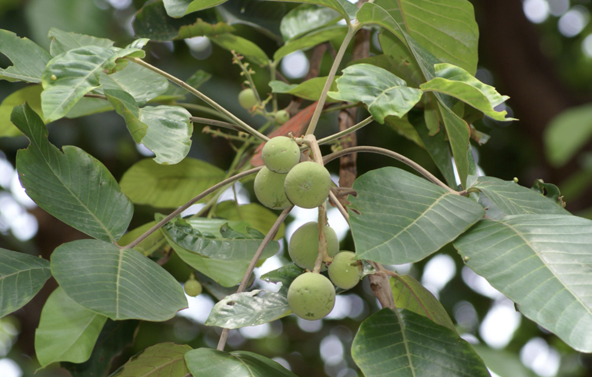

tags:: species
alias:: santol, sentol, wild mangosteen, kecapi, pohon sentul

- 
- http://www.plantsofasia.com/index/sandoricum/0-840
- https://en.wikipedia.org/wiki/Sandoricum_koetjape
- https://www.tokopedia.com/amartamanhias/tanaman-langka-pohon-kecapi-sandoricum-koetjape?extParam=ivf%3Dfalse%26src%3Dsearch
- height: up to 3 m
-