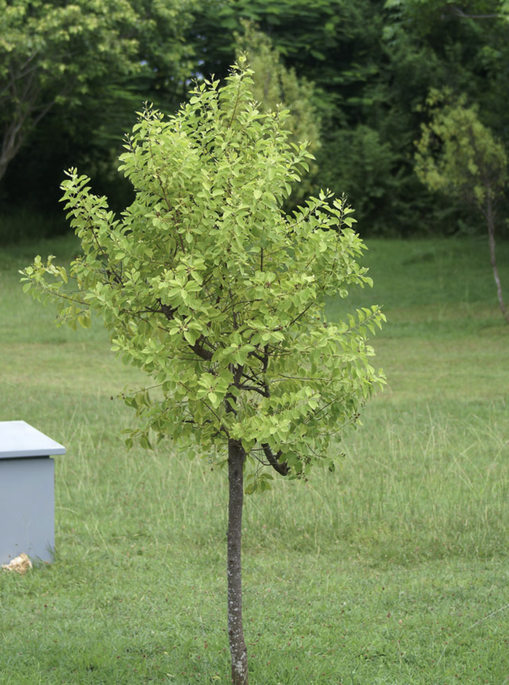

tags:: species
alias:: cendana, east indian sandalwood, sandal, sandalwood

- 
- http://www.plantsofasia.com/index/santalum/0-862
- height: 4-9 m
- https://en.wikipedia.org/wiki/Santalum_album
- https://www.tokopedia.com/najabmart/bibit-pohon-santalum-album-bibit-pohon-cendana-beribu-manfaat-murahhh?extParam=ivf%3Dfalse%26src%3Dsearch
-