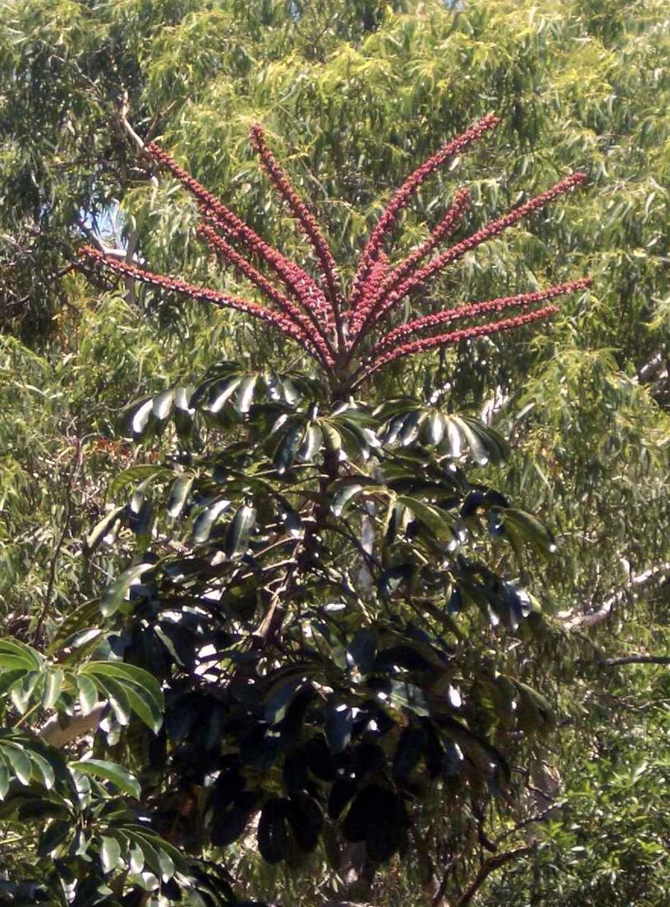

tags:: species
alias:: brassaia, octopus tree

- 
- height: 15m
- http://www.plantsofasia.com/index/schefflera_actinophylla/0-806
- https://en.wikipedia.org/wiki/Heptapleurum_actinophyllum
- https://www.tokopedia.com/jual-pohon-hias/bibit-pohon-gurita-tanaman-schefflera-actinophylla?extParam=ivf%3Dfalse%26src%3Dsearch
-