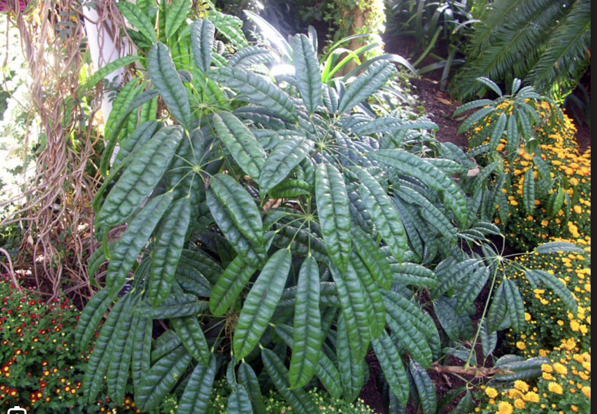

tags:: species
alias:: schefflera albido bracteata

- 
- https://en.wikipedia.org/wiki/Heptapleurum_albidobracteatum
- https://www.tokopedia.com/tanamanbuahtin/tanaman-schefflera-albido-bracteata-walisongo-pete?extParam=ivf%3Dfalse%26src%3Dsearch
- height: up to 3m