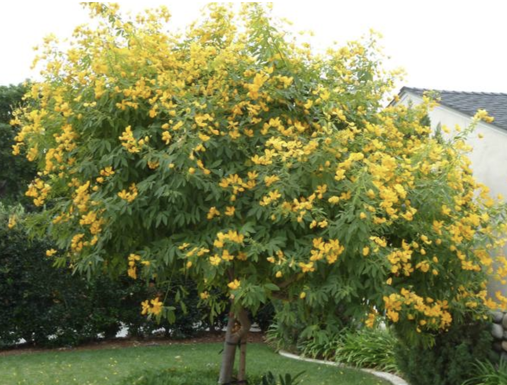

tags:: species
alias:: argentina senna, buttercup bush

- 
- height: up to 1m
- https://en.wikipedia.org/wiki/Senna_corymbosa
- https://www.tokopedia.com/ghosthunter577/benih-bibit-biji-pohon-bunga-buttercup-bush-senna-corymbosa-flower?extParam=ivf%3Dfalse
-