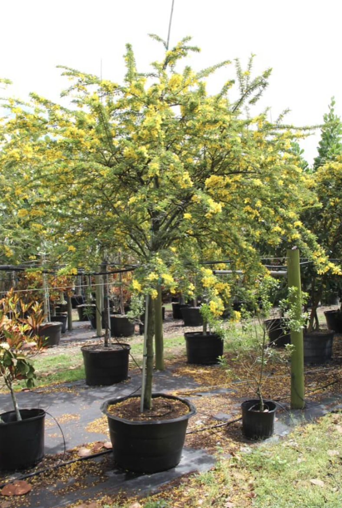

tags:: species
alias:: desert cassia

- 
- height: 1.5-2.5m
- http://www.plantsofasia.com/index/senna_polyphylla/0-379
- https://www.tokopedia.com/levineflorist/senna-polyphylla-akasia-accacia-golden-bibit-tanaman-hias-bunga?extParam=ivf%3Dfalse
-