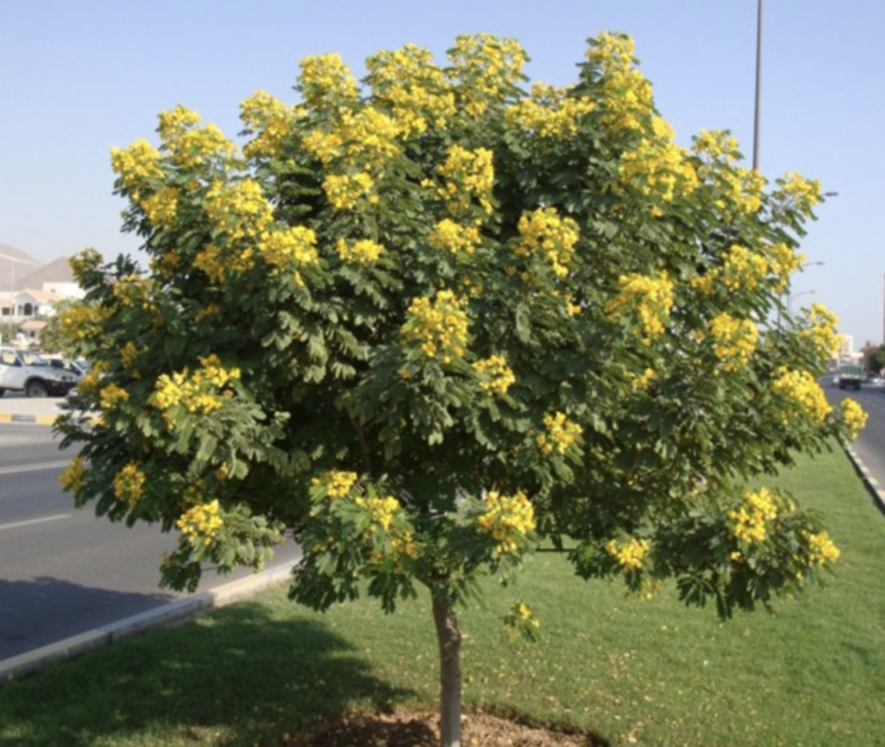

tags:: species
alias:: glaucous cassia, scrambled egg plant

- 
- height: 2-7m
- http://www.plantsofasia.com/index/senna_surattensis/0-381
- https://en.wikipedia.org/wiki/Senna_surattensis
- https://www.tokopedia.com/plantseed/bijibenihbibit-bunga-senna-surattensis?extParam=ivf%3Dfalse
-