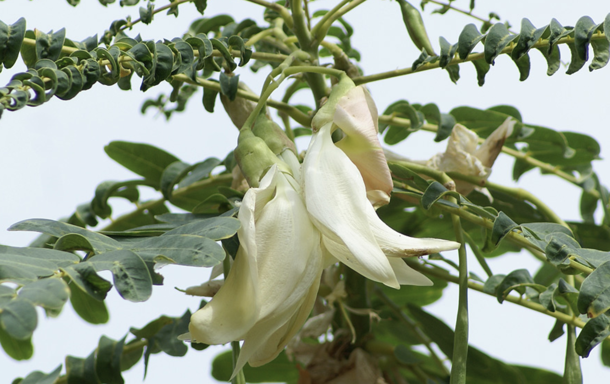

tags:: species
alias:: agathi, turi

- nitrogener:: 120
- 
- 
- http://www.plantsofasia.com/index/sesbania_grandiflora/0-644
- https://en.wikipedia.org/wiki/Sesbania_grandiflora
- height: 5-25m
- https://www.tokopedia.com/dermagasumberbibit/bibit-tanaman-pohon-turi-merah-unggul?extParam=ivf%3Dfalse
- https://www.tokopedia.com/tanibibitherb/bibit-pohon-bunga-turi-putih-tanaman-kembang-outdoor-daun-obat-herbal?extParam=ivf%3Dfalse&src=topads
-