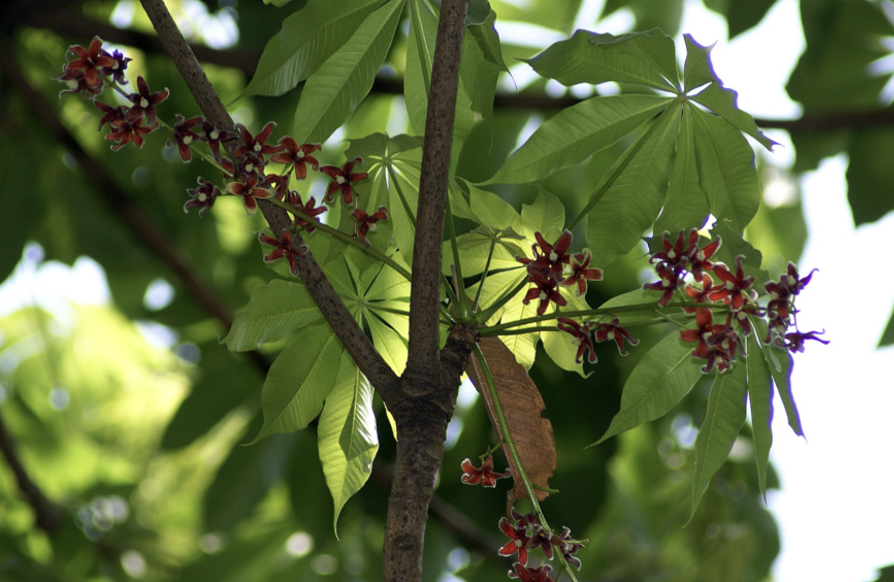
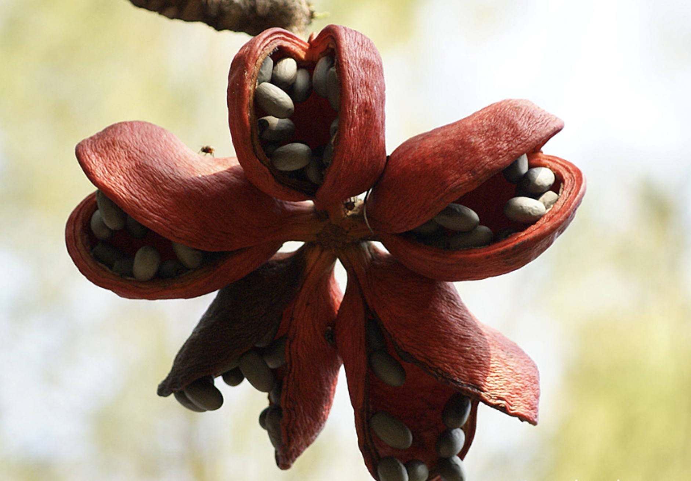

tags:: species
alias:: java olive tree, wild almond tree, kepuh, indian almond

- 
- 
- 
- height: up to 35 m
- https://en.wikipedia.org/wiki/Sterculia_foetida
- https://www.tokopedia.com/alam1ndonesia/bibit-tanaman-herbal-penghijauan-pohon-taman-sterculia-foetida?extParam=ivf%3Dfalse%26src%3Dsearch
- http://www.plantsofasia.com/index/sterculia_foetida/0-462
-