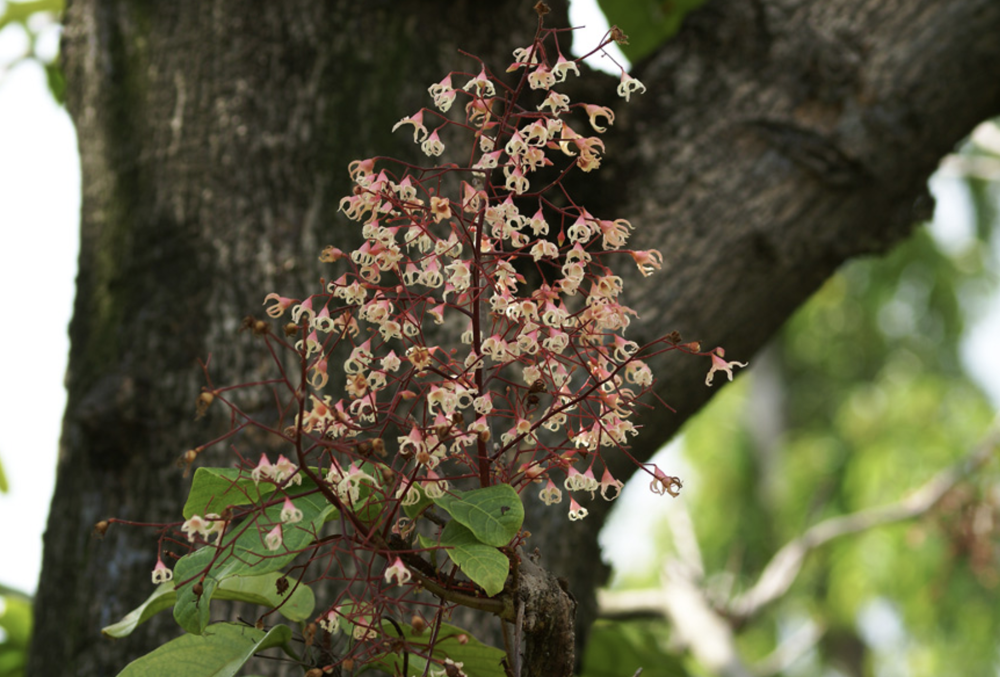

tags:: species
alias:: chinese chestnut, thai chestnut, seven sisters fruit

- 
- http://www.plantsofasia.com/index/sterculia_monosperma/0-463
- https://en.wikipedia.org/wiki/Sterculia_monosperma
- https://www.tokopedia.com/agusid-1/bibit-biji-berangan-cina-5-biji-sterculia-monosperma?extParam=ivf%3Dfalse%26src%3Dsearch
-