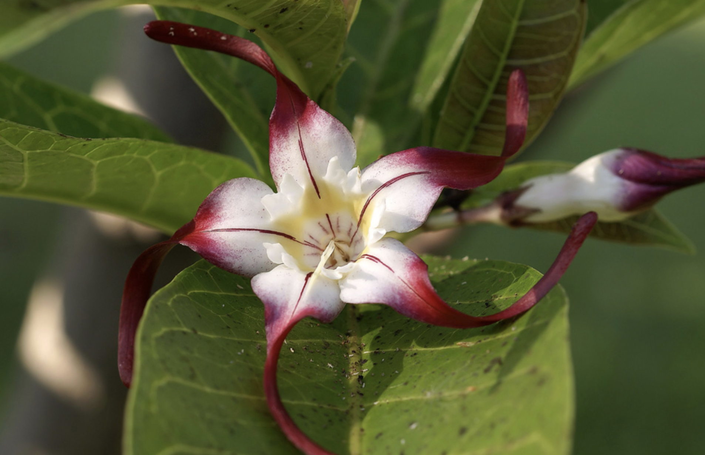

tags:: species
alias:: strophanthus

- 
- 
- height: up to 12m
- https://en.wikipedia.org/wiki/Strophanthus_caudatus
- http://www.plantsofasia.com/index/strophanthus/0-140
- https://www.tokopedia.com/ragamnoorsery/bibit-tanaman-strophanthus-gratus-melati-papua-wangi-1-meter?extParam=ivf%3Dfalse&src=topads
-