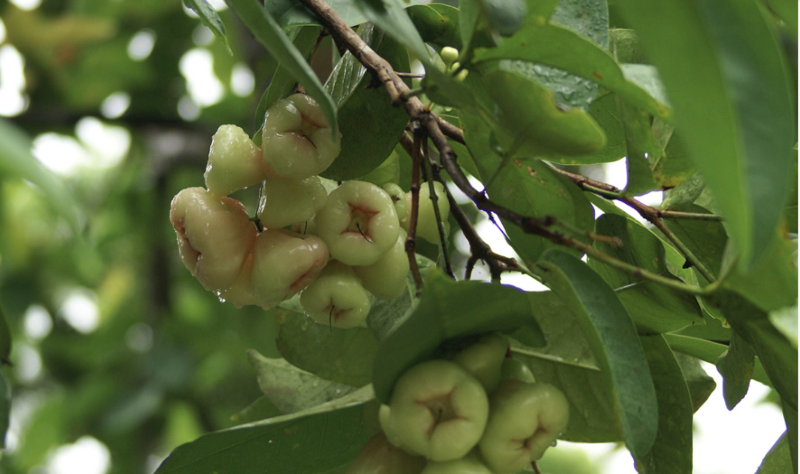

tags:: species
alias:: water apple, water cherry, watery rose apple, jambu air

- 
-
- height up to 15 m
- http://www.plantsofasia.com/index/syzygium_aqueum/0-301
- https://www.tokopedia.com/kores/terlaris-bibit-jambu-air-madu-deli-jumbo-syzygium-aqueum-okulasi-super?extParam=ivf%3Dfalse%26src%3Dsearch
- https://en.wikipedia.org/wiki/Syzygium_aqueum
-