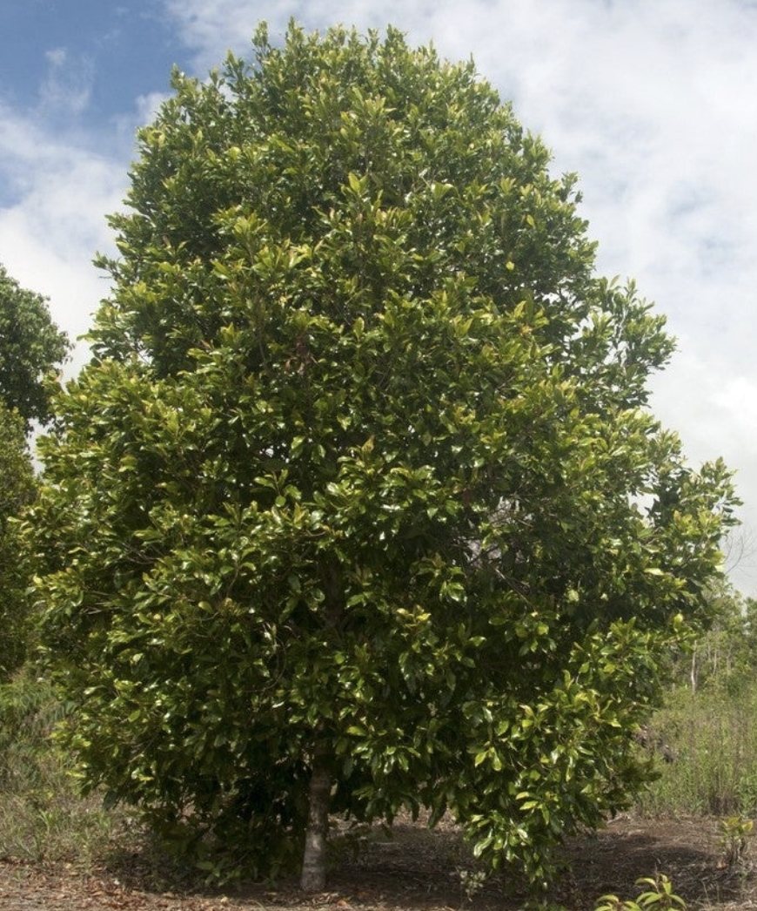
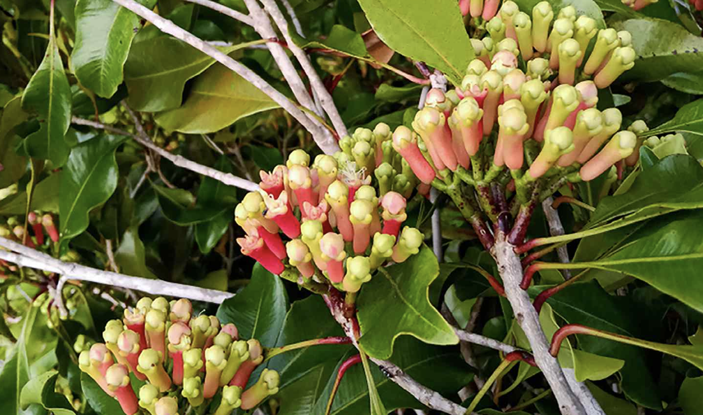

tags:: species
alias:: clove, chengkeh,

- 
- 
- height: 8-12m
- https://en.wikipedia.org/wiki/Clove
- http://www.plantsofasia.com/index/syzygium_aromaticum/0-674
- https://www.tokopedia.com/tokoorganikpnd/bibit-cengkeh-kualitas-unggul-cepat-berbuah-bibit-pohon-cengkih?extParam=ivf%3Dfalse%26src%3Dsearch&refined=true
-