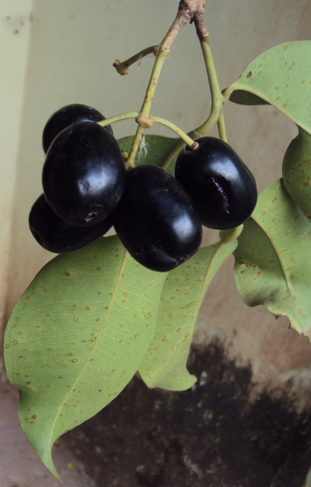

tags:: species
alias:: black plum, damson plum, jambolan plum, java plum

- 
- 
- height: up to 30 m
- https://en.wikipedia.org/wiki/Syzygium_cumini
- http://www.plantsofasia.com/index/syzygium_cumini/0-302
- https://www.tokopedia.com/ervakios/bibit-tanaman-buah-juwet-jamblang-malabar-java-plum-syzygium-cumini?extParam=ivf%3Dfalse%26src%3Dsearch
-