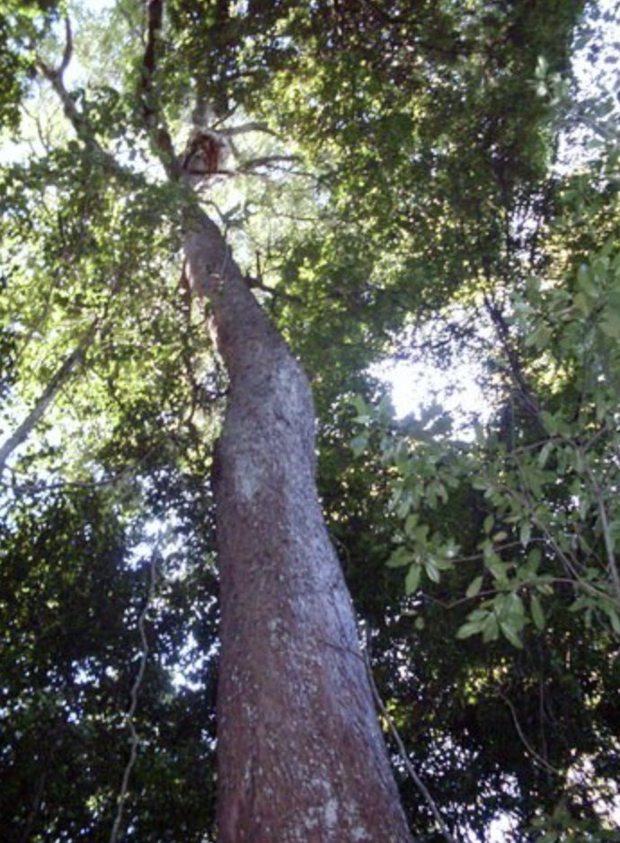

tags:: species

- 
- 
- 
- height: up to 35m
- https://en.wikipedia.org/wiki/Syzygium_paniculatum
- https://www.tokopedia.com/canaira/bibit-tanaman-buah-syzygium-paniculatum-varigata?extParam=ivf%3Dfalse%26src%3Dsearch
-