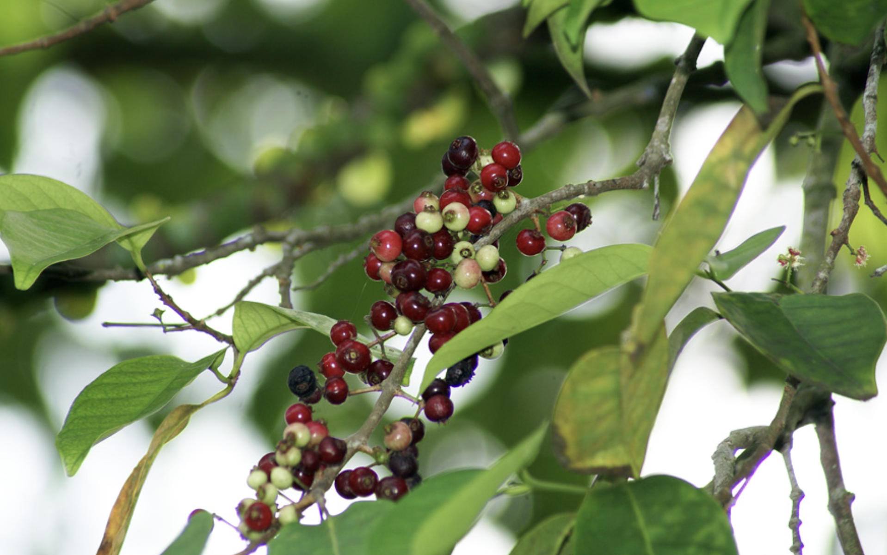

tags:: species
alias:: indonesian bayleaf, salam

- availability:: hanara
- 
- height: up to 25m
- http://www.plantsofasia.com/index/syzygium_polyanthum/0-737
- https://en.wikipedia.org/wiki/Syzygium_polyanthum
- https://www.tokopedia.com/archive-katusba/tanaman-daun-salam-syzygium-polyanthum?extParam=ivf%3Dfalse%26src%3Dsearch
-