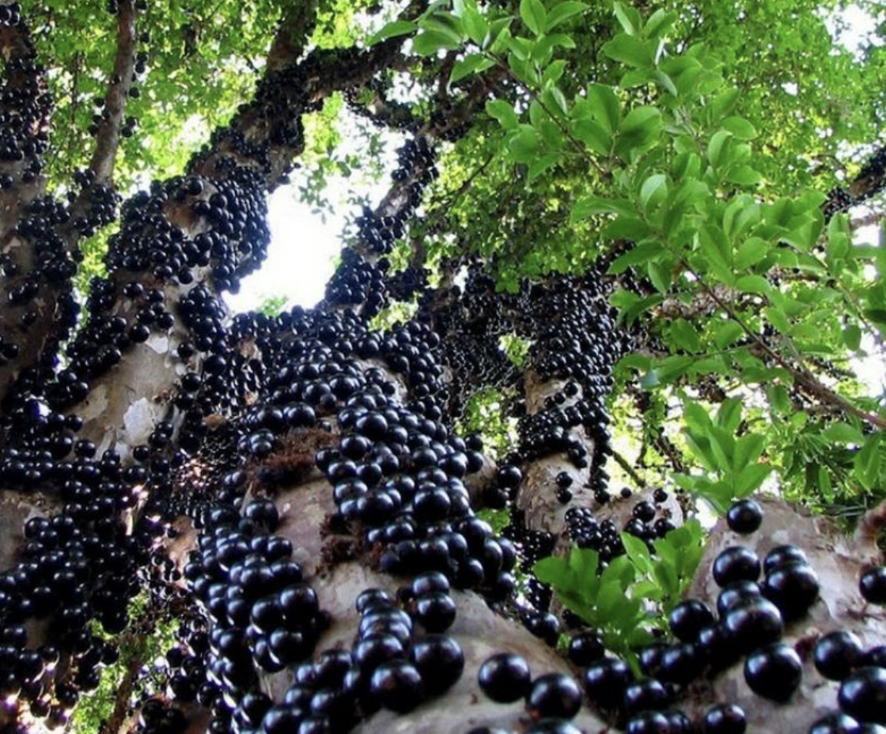

tags:: species
alias:: gowok, kupa

- 
- height: 8-20m
- https://id.wikipedia.org/wiki/Gowok
- http://www.plantsofasia.com/index/syzygium_polycephalum/0-675
- https://www.tokopedia.com/arjunafa/bibit-pohon-buah-gowok-atau-kupa-syzygium-polycephalum-zhgdrt-3236hs?extParam=ivf%3Dfalse%26src%3Dsearch
-
-