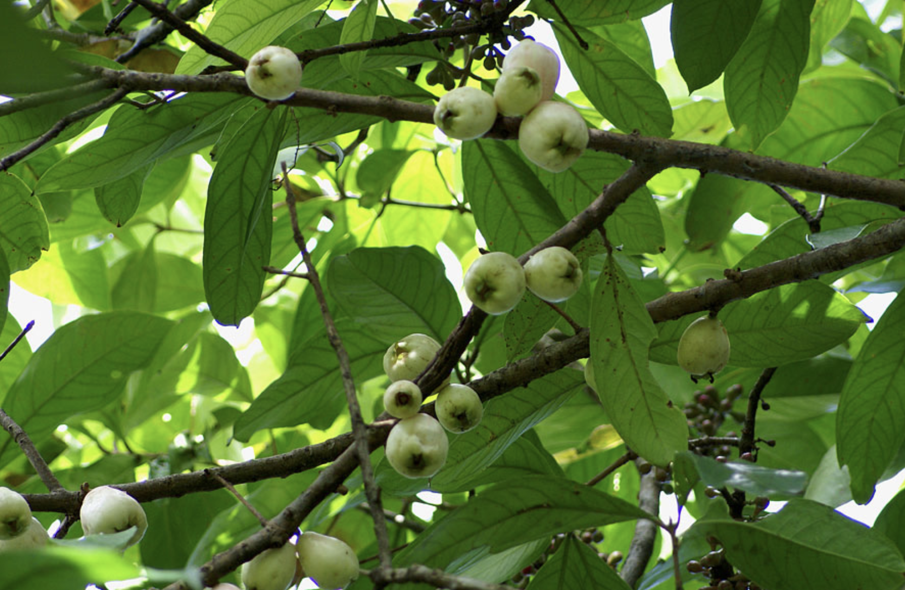
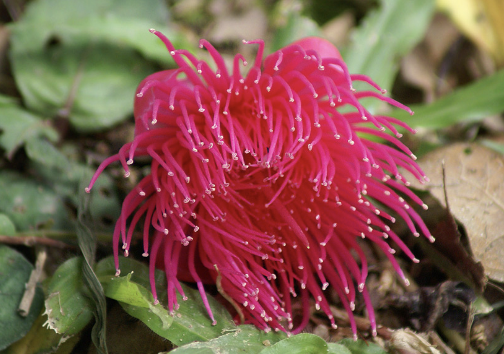

tags:: species
alias:: cloud apple, jambu semarang

- 
- 
- height: up to 12m
- http://www.plantsofasia.com/index/syzygium_samarangense/0-305
- https://en.wikipedia.org/wiki/Syzygium_samarangense
- https://www.tokopedia.com/levineflorist/syzygium-samarangense-jambu-air-dalhari-bibit-tanaman-buah-buahan?extParam=ivf%3Dfalse%26src%3Dsearch
-