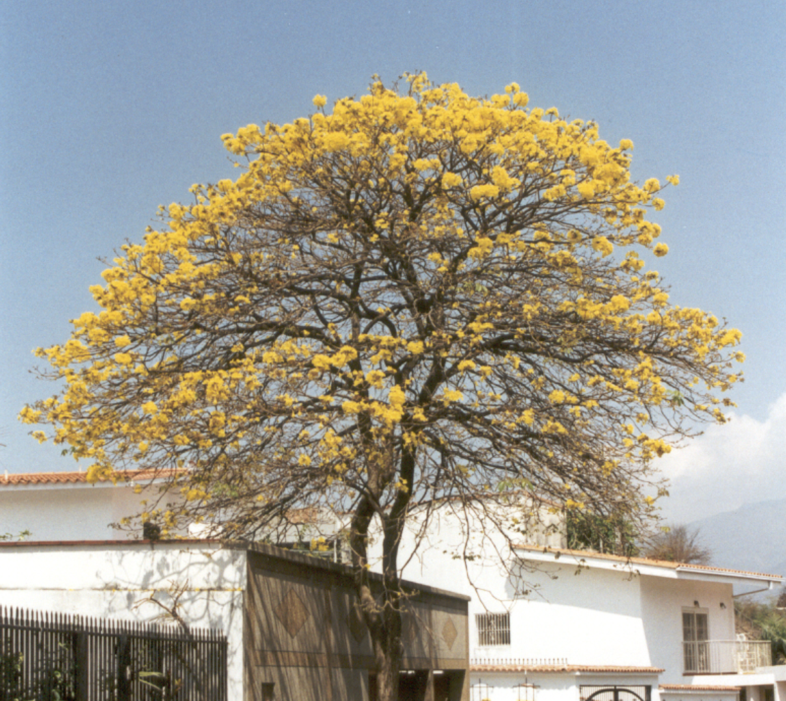

tags:: species
alias:: handroanthus chrysanthus, araguane, yellow ipe

- 
- https://en.wikipedia.org/wiki/Handroanthus_chrysanthus
- height: 6-12m
- https://www.tokopedia.com/hobbytaman/bibit-tanaman-hias-tabebuya-bunga-kuning-tanaman-tabebuia-chrysantha?extParam=ivf%3Dfalse%26src%3Dsearch
- http://www.plantsofasia.com/index/handroanthus_chrysanthus/0-345
-