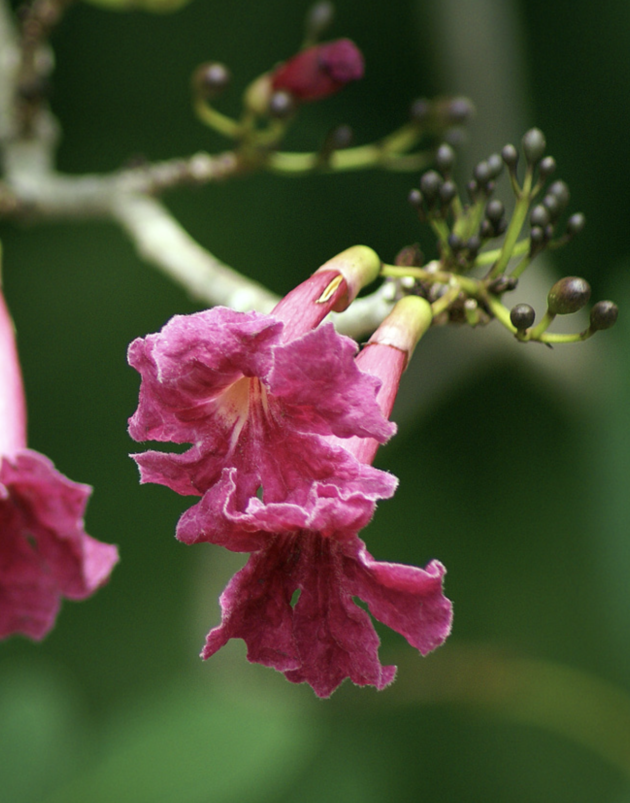

tags:: species
alias:: blood-red trumpet tree, roble cimarron

- availability:: hanara
- 
- 
-
- height: up to 5m
- http://www.plantsofasia.com/index/tabebuia_haemantha/0-346
- https://www.tokopedia.com/hanaranurseries/tabebuia-haemantha-tabebuia-merah-pohon-instan-instant-tree?extParam=ivf%3Dfalse%26src%3Dsearch
-