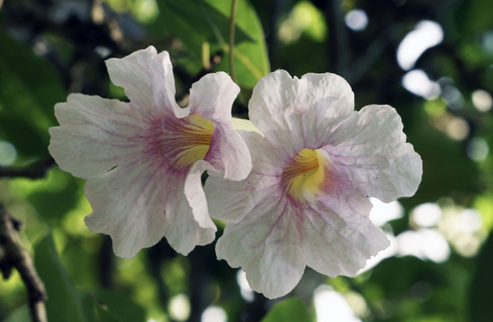
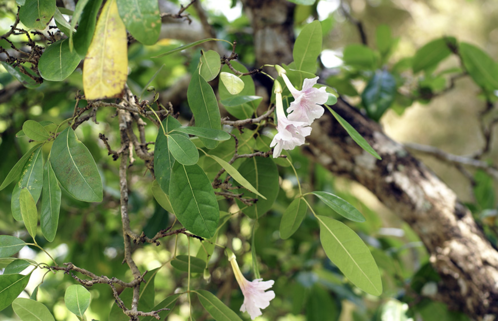

tags:: species
alias:: cuban pink trumpet tree, white cedar

- availability:: hanara
- 
- 
- http://www.plantsofasia.com/index/tabebuia_pallida/0-349
- https://en.wikipedia.org/wiki/Tabebuia_pallida
- https://www.tokopedia.com/hanaranurseries/tabebuia-pallida-bunga-pink-daun-kecil-pohon-instan-instant-tree?extParam=ivf%3Dfalse%26src%3Dsearch
-