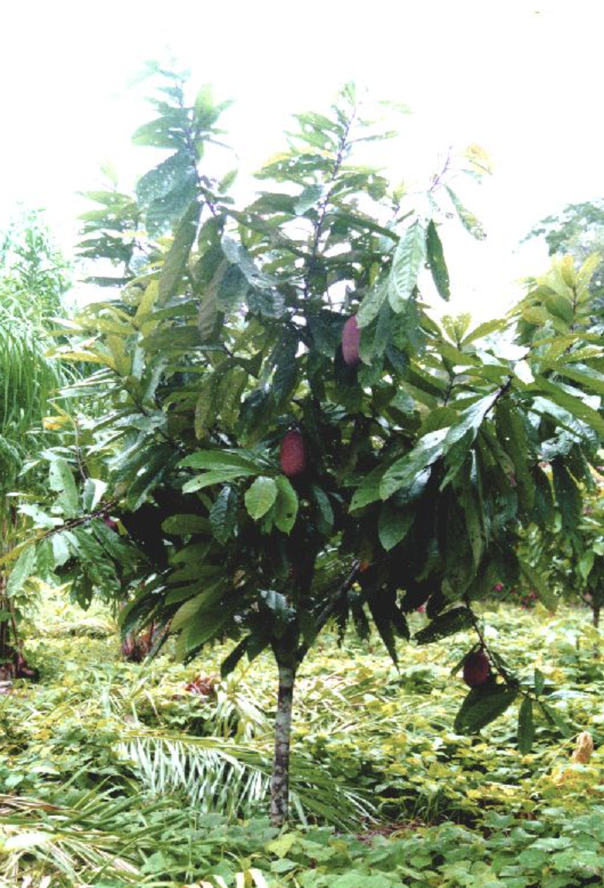

tags:: species
alias:: cupuacu, wild cacao

- 
- http://www.plantsofasia.com/index/theobroma_grandiflorum/0-575
- https://www.tokopedia.com/erlitagaluh/bibit-pohon-buah-exotic-cupuacu?extParam=ivf%3Dfalse%26src%3Dsearch
- https://en.wikipedia.org/wiki/Theobroma_grandiflorum
- height: 5-15m
-