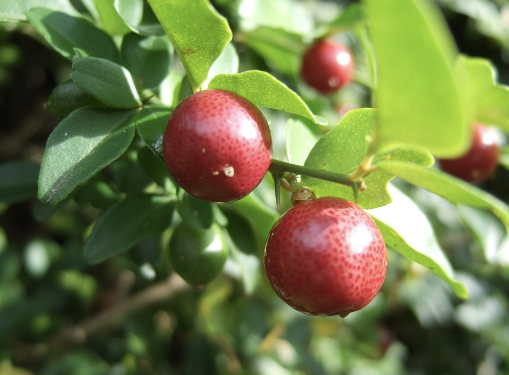

tags:: species
alias:: limeberry, sweet lime, jeruk kingkit

- 
- https://en.wikipedia.org/wiki/Triphasia_trifolia
- http://www.plantsofasia.com/index/triphasia/0-549
- https://www.tokopedia.com/gulkika-hujilopa/bahan-bonsai-jeruk-kingkit-triphasia-trifolia-dari-biji-lime-berry?extParam=ivf%3Dfalse%26src%3Dsearch
-