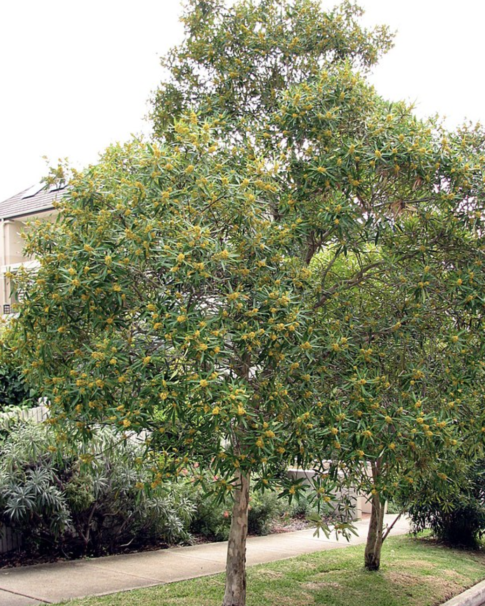

tags:: species
alias:: yellow panda, pelawan merah

- 
- http://www.plantsofasia.com/index/tristaniopsis_merguensis/0-1306
- https://www.tokopedia.com/mocca/bibit-pohon-pelawan-pakan-lebah-madu-pahit?extParam=ivf%3Dfalse%26src%3Dsearch
- https://en.wikipedia.org/wiki/Tristaniopsis
-