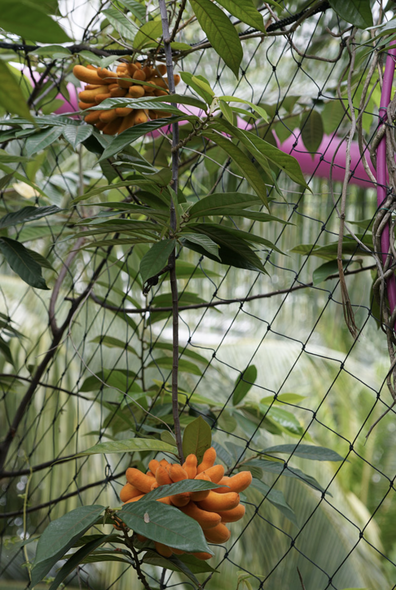

tags:: species
alias:: kalak, pisang akar, tali pisang

- {:height 798, :width 530}
- https://id.wikipedia.org/wiki/Akar_layak
- https://www.tokopedia.com/bibitjakarta/buah-kalak-bibit-buah-susu-munding-segar-buah-langka-manis-segar?extParam=ivf%3Dfalse%26src%3Dsearch
- http://www.plantsofasia.com/index/uvaria/0-1006
-