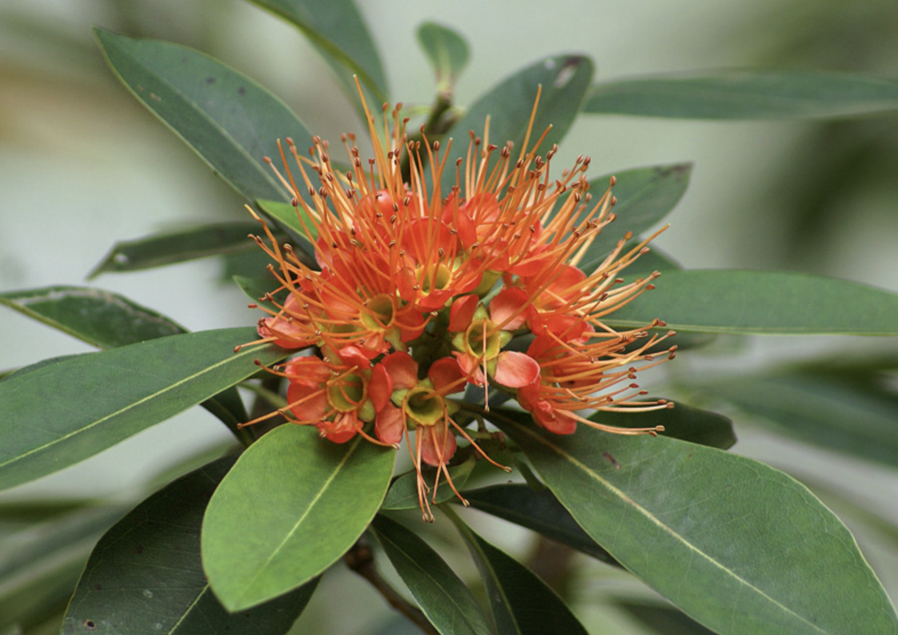

tags:: species
alias:: orange penda

- 
- http://www.plantsofasia.com/index/xanthostemon_chrysanthus_orange_form/0-582
- https://www.tokopedia.com/nesthoney/bunga-hias-bunga-santos-lemon-merah-xantostemon-xanthostemon?extParam=ivf%3Dfalse%26src%3Dsearch
-
-