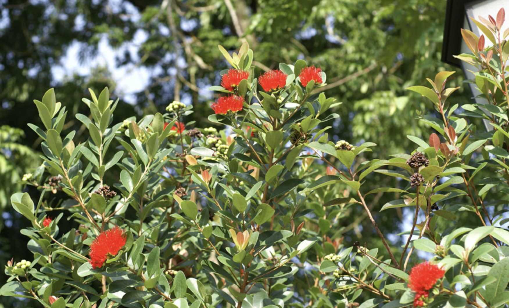

tags:: species
alias:: crimson penda, red penda

- 
- https://en.wikipedia.org/wiki/Xanthostemon_youngii
- https://www.tokopedia.com/archive-katusba/tanaman-hias-outdour-xanthostemon-youngii?extParam=ivf%3Dfalse%26src%3Dsearch
- http://www.plantsofasia.com/index/xanthostemon_youngii/0-479
-